<!-- HEADER BANNER -->

<!-- CODE SYMBOL DIVIDER -->

<h2 align="center" style="color:#00f2ff;">⚡ About Me</h2>

 

  I'm a <strong>BCA student</strong> and a passionate <strong>MERN Stack Web Developer</strong> from India. 
  I enjoy building real-world applications, learning modern technologies, 
  and exploring <strong>Artificial Intelligence</strong> and <strong>Machine Learning</strong>. 
  My long-term goal is to become an excellent software engineer and create impactful AI-driven solutions.

<table align="center">
  <tr>
    <td>🔭 Currently working on</td>
    <td><strong>ECOMMERCE PROJECT</strong></td>
  </tr>
  <tr>
    <td>🌱 Currently learning</td>
    <td><strong>React Native</strong></td>
  </tr>
  <tr>
    <td>🎓 Education</td>
    <td><strong>BCA – Computer Science</strong></td>
  </tr>
  <tr>
    <td>💬 Ask me about</td>
    <td><strong>MERN Stack | JavaScript | Web Dev</strong></td>
  </tr>
  <tr>
    <td>📫 Reach me at</td>
    <td><strong>devukrishnank2025@gmail.com</strong></td>
  </tr>
  <tr>
    <td>🌍 Based in</td>
    <td><strong>India</strong></td>
  </tr>
</table>

---

<h2 align="center" style="color:#00f2ff;">🚀 My Services</h2>

| 🌐 Web Development | 🎨 Frontend UI | ⚙️ Backend & APIs |
|:---:|:---:|:---:|
| Responsive, fast & scalable websites using modern web technologies with clean UI and solid backend logic. | User-friendly interfaces with focus on usability, performance, and modern design principles. | REST APIs, database management, and server-side logic using Node.js and MongoDB. |

---

<h2 align="center" style="color:#00f2ff;">🛠️ My Expertise</h2>

  &nbsp;
  &nbsp;
  &nbsp;
  &nbsp;
  &nbsp;
  &nbsp;
  &nbsp;
  &nbsp;
  &nbsp;
  &nbsp;
  &nbsp;
  &nbsp;
  &nbsp;
  

---

<h2 align="center" style="color:#00f2ff;">📊 GitHub Stats</h2>

  
  &nbsp;
  

  

---

<h2 align="center" style="color:#00f2ff;">💼 My Work</h2>

| 🌐 Web Applications | 📚 Learning Projects | 🤖 Future AI Projects |
|:---:|:---:|:---:|
| Full-stack web apps with authentication, database integration, and clean UI. | Projects built while learning MERN stack, APIs, and system design basics. | Planned projects combining AI, NLP, and computer vision concepts. |
| `React` `Node` `MongoDB` | `MERN` `API` `UI/UX` | `Python` `TensorFlow` `NLP` |

---

<h2 align="center" style="color:#00f2ff;">🗓️ Experience</h2>

  📌 <strong>2025 – Present</strong> — Building personal and academic web projects using MERN Stack 
  📌 <strong>2024 – 2025</strong> — Practiced responsive UI design and backend integration 
  📌 <strong>Learning Phase</strong> — Improving problem-solving and coding consistency

---

<h2 align="center" style="color:#00f2ff;">🌐 Connect With Me</h2>

  &nbsp;
  &nbsp;
  &nbsp;
  &nbsp;
  &nbsp;
  &nbsp;
  

  

<!-- FOOTER WAVE -->

  <em>© Devukrishnan — Made with ❤️</em>

